<!-- ======================= BANNER ======================= -->

 

<!-- ============== TÍTULO + TERMINAL ============== -->

<table border="0" cellspacing="0" cellpadding="0">
<tr>

<td width="43%" valign="middle">

<h2>> Cyber Snoopy<code>_</code></h2>

<h3>🧬 Software Engineer / Ethical Hacker</h3>

<em>
Uso LINUX como se fosse andar. 
I use Linux like I would walk.
</em>

🧠 ~1 year of reverse engineering in games and software 
⚡ Apps · Kali Linux · Games · Software · Malware

</td>

<td width="57%" valign="middle" align="center">

</td>

</tr>
</table>

 

<!-- ======================= STACK / BADGES ======================= -->

 

<!-- ======================= MINI DESCRIPTION ======================= -->

> 🇧🇷 **Ethical Hacker & Software Reverse Engineer.**  
> Atuo na análise, compreensão e segurança de softwares, buscando entender como sistemas funcionam por dentro e identificar vulnerabilidades antes que possam ser exploradas de forma maliciosa.
>
> Trabalho com **engenharia reversa**, **análise de binários**, **debugging**, **análise de memória**, **protocolos**, **criptografia**, **proteção de aplicações** e **pesquisa de segurança**.

> 🇺🇸 **Ethical Hacker & Software Reverse Engineer.**  
> I specialize in analyzing, understanding, and securing software by looking beyond the surface to uncover how systems work internally and identify vulnerabilities before they can be abused.
>
> My work involves **reverse engineering**, **binary analysis**, **debugging**, **memory analysis**, **network protocols**, **cryptography**, **application security**, and **security research**.

 

<!-- ======================= STACK & SKILLS ======================= -->

<b>🧰 Stack & skills / O que eu uso</b>

 

**Ethical Hacking:** penetration testing, vulnerability assessment, security auditing, web security, network security, authentication and access control.

**Reverse Engineering:** binary analysis, debugging, software behavior analysis, memory analysis, static & dynamic analysis, code understanding.

**Security Research:** vulnerability research, attack surface analysis, protocol analysis, cryptography, malware analysis, application hardening.

**Tools & Development:** C / C++, Python, scripting, custom security tools, automation, debuggers, analyzers and security-oriented software.

 

<!-- ======================= GITHUB STATS ======================= -->

<b>📊 GitHub stats</b>

 

 

<!-- ======================= CONTATO ======================= -->

<b>📫 Contato / Contact</b>

 

- 🌐 Site / Portfolio — **[Em breve](#)**
- 💬 Discord / X / LinkedIn — **[Em breve](#)**
- ✉️ E-mail — **[Em breve](#)**

 

<!-- ======================= RODAPÉ ======================= -->

<code>></code> compiling ideas into reality · <b>Cyber Snoopy</b> <code>_</code>

